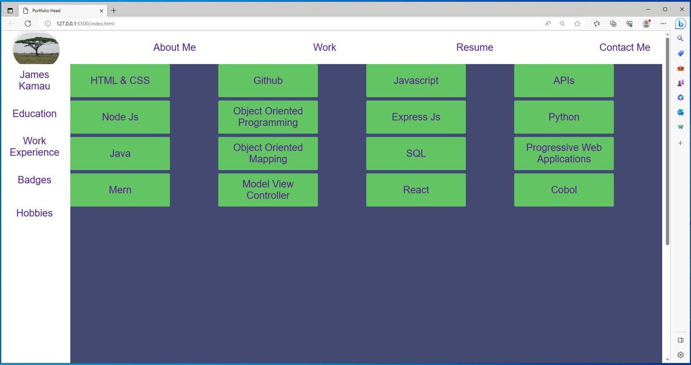

## User Story

```
AS AN employee candiddate
I WANT prospective employers to view a potential deployed portfolio of work samples
SO THAT they can review samples of my work and assess whether I'm a good candidate for an open position
```


## Acceptance Criteria


```
GIVEN I need to provide a sample of my previous work
WHEN they load my portfolio
THEN they are presented with the my name, a recent photo or avatar, and links to sections about me, my work, and how to contact me
WHEN they click one of the links in the navigation
THEN the UI scrolls to the corresponding section
WHEN they click on the link to the section about my work
THEN the UI scrolls to a section with titled images of the developer's applications
WHEN they are presented with my first application
THEN that application's image is larger in size than the others
WHEN they click on the images of the applications
THEN they are taken to that deployed application
WHEN they resize the page or view the site on various screens and devices
THEN I am presented with a responsive layout that adapts to my viewport
```


## Mock-Up -- hot links

The following animation shows the web application's appearance and functionality:


[Portfolio Demo Video](portfolio.webm)


